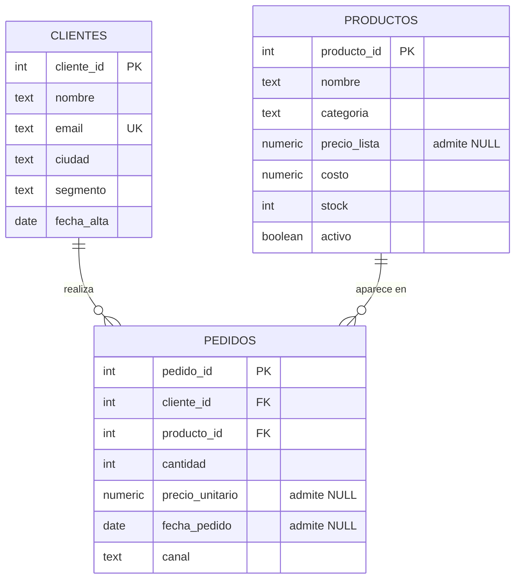

# Análisis exploratorio de ventas de una tienda online

Proyecto Capstone de la cursada de SQL. Ignacio Kalogiannidis. PostgreSQL 16.

Análisis de dos años de operación de un e-commerce: modelo de datos, etapa de limpieza y seis preguntas de negocio resueltas en SQL, con sus conclusiones. Las preguntas cubren cuatro ángulos: quién compra, cómo evoluciona la facturación, qué pasa con el catálogo y por dónde entra la plata.

## El trabajo en una tabla

| | |
|---|---|
| Período analizado | 1 de enero de 2024 al 30 de diciembre de 2025, 730 días con pedidos |
| Volumen | 200 clientes, 60 productos, 4.879 pedidos |
| Facturación del período | 27.027.861,66 |
| Pedidos sin precio cargado | 714, el 14,6 por ciento |
| Pedidos sin fecha | 154, el 3,2 por ciento |
| Recuperado por la limpieza | 3.902.322,00 |
| Variación interanual | caída del 9,4 por ciento, 8,9 normalizada por día |
| Concentración de cartera | el primer cuartil, 48 clientes, explica el 38,3 por ciento |
| Catálogo sin rotación | 6 productos sin ventas, 740.321,50 a costo |

Todos los importes están en pesos y todas las cifras del documento salen de ejecutar los dos scripts.

## El problema de negocio

La dirección de la tienda tiene que decidir dónde poner el esfuerzo comercial del próximo ejercicio y no tiene con qué fundamentarlo. Hay dos años de pedidos cargados en la base, pero nadie los miró nunca en conjunto. Las preguntas son concretas: de quién depende la facturación, si el negocio está creciendo o cayendo, qué parte del catálogo no se mueve y cuánta plata hay atrapada en productos que no rotan.

Antes de responderlas aparece un problema previo. Casi el quince por ciento de los pedidos no tiene precio cargado y un tres por ciento no tiene fecha. Cualquier total calculado sin tratar esos huecos sale mal, así que la primera parte del trabajo es decidir qué hacer con ellos.

## Cómo ejecutar el código

Se necesita PostgreSQL 16 o superior. Los dos scripts se corren en orden, desde la carpeta del repositorio:

```bash
createdb capstone_project
psql -d capstone_project -f estructura.sql
psql -d capstone_project -f analisis.sql
```

El primero crea las tres tablas y carga los datos. El segundo perfila, limpia y analiza; no modifica ninguna tabla, solo lee y crea una vista.

Los dos se pueden volver a correr sobre la misma base. `estructura.sql` empieza eliminando lo que va a recrear, incluida la vista que crea el otro script, y `analisis.sql` usa `CREATE OR REPLACE` sobre esa vista.

Los datos se generan con aritmética modular sobre `generate_series`, sin `random()`. Así cualquiera que clone el repositorio y ejecute los scripts obtiene exactamente las mismas filas y puede reproducir todos los números de este documento.

## Los archivos

| Archivo | Contenido |
|---|---|
| `estructura.sql` | Definición de las tres tablas, carga del dataset, índices y verificación de la carga |
| `analisis.sql` | Perfilado de nulos, vista limpia, control del JOIN y seis preguntas de negocio |
| `README.md` | Contexto, decisiones de modelado y limpieza, y hallazgos |

## El modelo de datos



Cada fila de `pedidos` es la compra de un producto por un cliente en una fecha. No hay una tabla de detalle separada porque ninguna de las preguntas del análisis necesita agrupar varias líneas bajo un mismo ticket, y una cuarta tabla habría complicado el modelo sin agregar respuestas.

Los tipos se eligieron para no tener que limpiar después. Las fechas van en `DATE` porque sobre ese tipo funcionan la aritmética de fechas y `DATE_TRUNC`, y porque el motor rechaza una fecha imposible en lugar de aceptarla como cadena. El dinero va en `NUMERIC(10,2)`, que es de precisión exacta; con punto flotante, el error de redondeo se vuelve visible al sumar miles de importes.

Las restricciones acompañan esa decisión. El email lleva `UNIQUE` porque identifica al cliente, más un `CHECK` de formato. Las cantidades y los importes llevan `CHECK` de signo, porque un importe negativo es un error de carga y no un pedido. Canal, categoría y segmento son dominios cerrados y se declaran como tales, para que un error de tipeo no invente una quinta categoría que después aparezca como una fila suelta en cada agrupación. Y las claves foráneas impiden un pedido de un cliente o un producto que no existen.

Sobre los índices se creó lo mínimo: las dos claves foráneas, que es por donde `pedidos` se une con el resto y que PostgreSQL no indexa por su cuenta, y un B-Tree sobre `fecha_pedido`, que es la columna por la que filtra y agrupa la serie temporal. `canal` y `categoria` quedaron sin indexar porque con cuatro y cinco valores distintos sobre miles de filas filtran demasiado poco, y cada índice de más se paga en cada escritura.

Volumen cargado: 200 clientes, 60 productos y 4.879 pedidos. De esos pedidos, 154 llegaron sin fecha; el resto se reparte sobre los 730 días que van del 1 de enero de 2024 al 30 de diciembre de 2025. Todos los importes de este documento están en pesos.

## La etapa de limpieza

La regla que ordena esta parte es que un nulo no es un cero. El cero afirma que la venta fue de cero pesos; el nulo admite que no sabemos cuánto fue. Confundirlos hunde los promedios y los totales, así que cada hueco se trató por separado.

El perfilado inicial encontró que 714 pedidos de 4.879, el 14,6 por ciento, no tienen precio unitario, y que 154, el 3,2 por ciento, no tienen fecha.

El hueco de precio tiene dos gravedades distintas y la consulta las separa. En 406 casos el producto sí tiene precio de lista cargado, así que el importe se completa con `COALESCE` tomando ese precio. Esa sustitución es válida porque en este negocio el precio cobrado es el de lista menos un descuento de hasta diez por ciento, o sea que las dos columnas viven en la misma escala. Si el precio efectivamente cobrado fuera varias veces el de lista, el mismo `COALESCE` subestimaría la facturación de forma sistemática y habría que buscar otra fuente. Con la escala verificada, la operación recuperó 3.902.322,00 que sin la limpieza se habrían perdido en silencio.

Los 308 casos restantes son más difíciles: ni el pedido ni el producto tienen precio, y tampoco se puede deducir del costo, porque el margen varía por artículo. Esas ventas se cuentan como unidades movidas, 308 en total, pero su facturación queda en nulo. Ponerles cero habría afirmado que se regalaron.

El análisis verifica además que ese hueco esté repartido y no concentrado: va del 5,0 por ciento de los pedidos en Deportes al 8,2 por ciento en Electrónica, así que ninguna categoría queda excluida respecto de las demás. Si hubiera caído todo en una sola, cualquier comparación entre categorías habría sido inválida sin que el promedio general lo mostrara.

Con las fechas la decisión fue la contraria. No hay forma de estimar la fecha de un pedido a partir del resto de la fila, y una fecha inventada contamina cualquier serie temporal sin dejar rastro. Lo que sí se hizo con `COALESCE` fue etiquetar: la columna `periodo` de la vista limpia devuelve el mes del pedido, o la etiqueta "Sin fecha" cuando falta. Así esos pedidos no desaparecen del informe sin que nadie lo note, sino que se reportan como su propio período. Son 313.281,15 de facturación que queda fuera de cualquier análisis temporal.

Toda la limpieza se resuelve una sola vez, en la vista `ventas_limpias`, y las seis consultas parten de ahí. Si cada consulta limpiara por su cuenta, alcanzaría con que a una se le escapara el `COALESCE` para que los totales del informe dejaran de cerrar entre sí.

Por último, el análisis compara el conteo de filas antes y después del JOIN. Es el error más silencioso de todos: si la clave del lado derecho no fuera única, cada fila se duplicaría y todos los totales quedarían inflados sin que nada fallara. Las 4.879 filas de `pedidos` siguen siendo 4.879 después de unir con `productos`.

## Hallazgos

Facturación total del período, después de la limpieza: 27.027.861,66.

### El negocio se achicó casi un diez por ciento y el mes a mes no lo muestra

2024 cerró en 14.016.042,34 y 2025 en 12.698.538,17: una caída del 9,4 por ciento interanual.

Mirando la serie mensual eso no se ve. La variación de un mes contra el anterior tiene una media absoluta del 4,1 por ciento, con un desvío de 4,6 puntos, y llega a moverse entre el 15,9 por ciento negativo y el 15,1 por ciento positivo. Con esa amplitud, cualquier mes puede parecer un desastre o un récord sin que nada haya cambiado.

Hay una salvedad antes de usar la cifra. Los dos años no aportan la misma cantidad de días con actividad: 366 contra 364, porque el período cargado arranca el 1 de enero de 2024 y corta el 30 de diciembre de 2025. Medio punto de la caída es esa diferencia de ventana y no del negocio. Dividiendo por día, la baja queda en 8,9 por ciento, que es el número que corresponde citar.

Lo práctico es que la comparación interanual es la única que sirve para decidir acá, y no porque su número sea más grande, sino porque cada uno de sus dos términos agrega más de dos mil doscientos pedidos, 2.484 y 2.241 respectivamente, y por eso no lo mueve la oscilación que domina la serie mensual. Reaccionar a un mes malo aislado, en esta operación, es reaccionar a una variación que no significa nada.

### El cuartil que más gasta explica casi cuatro de cada diez pesos

La clasificación por cuartiles muestra una concentración clara pero no extrema: el primer cuartil, 48 clientes de un padrón de 200, explica el 38,3 por ciento de la facturación. El último, otros 47 clientes, aporta el 5,6 por ciento. Los dos cuartiles del medio aportan el 30,0 y el 26,1 por ciento, así que el negocio no está sostenido por un grupo chico sino por un cuerpo amplio de clientes medios.

La concentración está en el grupo, no en ninguna persona. El cliente más grande, Joaquín Álvarez, factura 331.293,46, que es el 1,23 por ciento del total, y la columna acumulada muestra que los cinco primeros juntos apenas llegan al 5,93 por ciento. Perder a un cliente grande es un golpe absorbible; perder al primer cuartil no lo es. Eso apunta a un programa de retención sobre esos 48 antes que a un esquema de trato personalizado uno por uno.

Los cuartiles se calculan sobre los 190 clientes que compraron, y los 10 sin actividad quedan en una categoría aparte en lugar de diluirse dentro del último cuartil. Separarlos importa para la lectura: mezclados, el cuartil de menor gasto parecería peor de lo que es, cuando en realidad el problema de esos diez no es que gasten poco sino que nunca empezaron.

### Hay diez clientes registrados que nunca compraron

Aparecen porque la consulta de segmentación usa `LEFT JOIN` desde `clientes`. Con un `INNER JOIN` no existirían en el informe, y ese es el punto: un cliente sin actividad no es un dato faltante, es un hallazgo. Son altas que nunca convirtieron y la conversión más barata disponible, porque el costo de captación ya se pagó y ya dieron sus datos.

### Los canales se diferencian por volumen y no por calidad de venta

El marketplace concentra el 43,1 por ciento de la facturación y la app el 28,4, mientras que web y teléfono se reparten el 14,3 cada uno. Visto así parece que hay canales buenos y canales malos.

El resto de las columnas dice otra cosa. El ticket promedio es casi idéntico en los cuatro: entre 5.872,19 y 5.960,71, una diferencia del uno y medio por ciento. La composición por antigüedad de cliente también es pareja, con los clientes nuevos aportando entre el 31,2 y el 32,7 por ciento en todos los casos.

O sea que ningún canal vende mejor que otro: vende más. La diferencia de facturación es diferencia de volumen de pedidos, 2.092 en el marketplace contra 695 en la web. Eso cambia la conclusión: no hay un canal que convenga privilegiar por rentabilidad, y la pregunta que queda abierta es de alcance, por qué la web y el teléfono reciben un tercio de los pedidos que recibe el marketplace. Es una pregunta de tráfico y no de propuesta comercial, y se responde con datos de visitas que esta base no tiene.

### La dependencia de un solo producto es desigual entre categorías

El ranking por categoría muestra diferencias claras. En Electrónica el Producto 050 encabeza con el 29,0 por ciento de la facturación de su categoría, y en Librería el Producto 044 llega al 24,5 por ciento, mientras que en Deportes el primero apenas alcanza el 18,8 por ciento y los tres primeros quedan dentro de cuatro puntos entre sí.

Ese porcentaje es un techo, por una razón que el propio análisis deja a la vista. Para entrar al ranking un producto necesita tener ventas y tener precio de lista, así que de los 12 artículos de cada categoría entran 10, y 9 en el caso de Electrónica. Las unidades que vendieron los excluidos no suman al denominador, y ahí está el sesgo: Indumentaria y Electrónica dejaron fuera 74 y 71 unidades contra 53 de Deportes, de modo que sus primeros puestos salen algo inflados frente a los del resto. La comparación entre categorías sirve para ordenar, no para afirmar que la diferencia es exactamente de diez puntos.

Lo que sí se sostiene es la conclusión operativa: hay artículos cuya caída se lleva puesta una porción grande de su categoría y otros donde el mismo problema se absorbe. El Producto 050 y el Producto 044 hay que tratarlos como críticos para el abastecimiento, y la forma de despejar la duda sobre la magnitud es cargar los precios que faltan, que es la misma acción que arregla el resto del informe.

### Seis productos no se vendieron nunca y tienen 740.321,50 inmovilizados

Son seis artículos sin una sola venta en dos años, con 195 unidades en depósito. A costo, eso es 740.321,50 de capital quieto, el 2,7 por ciento de lo que facturó el negocio en todo el período. De esos seis, cinco siguen marcados como activos en el catálogo.

La pregunta pedía los tres menos vendidos y la consulta devuelve los productos 055, 056 y 057, pero el recorte es arbitrario: los seis están empatados en cero unidades y quedarse con tres es cortar entre iguales. Por eso el análisis lista los seis, ordenados por el capital que tiene cada uno, que es el criterio que sirve para decidir por cuál empezar. El más caro es el Producto 057, con 49 unidades y 196.220,50 inmovilizados.

Esa lista aparece, además, porque la consulta une con `LEFT JOIN` desde `productos`. Un `INNER JOIN` habría devuelto los productos con pocas ventas y escondido justamente a los que no vendieron nada, que son los peores de todos, y es el error más fácil de cometer en esta pregunta.

### Qué haría con esto

Cuatro decisiones se desprenden de los números. Primero, atacar la caída, midiendo contra el año anterior y no contra el mes anterior, porque la serie mensual de esta operación no distingue una señal de una oscilación normal. Segundo, armar un programa de retención sobre los 48 clientes del primer cuartil y una campaña de activación sobre los 10 que nunca compraron, que son las dos puntas donde el esfuerzo tiene retorno medible. Tercero, liquidar los seis productos sin ventas, que son 740.321,50 parados, empezando por el Producto 057, y asegurar el abastecimiento del Producto 050 y del Producto 044. Cuarto, tratar la brecha entre canales como un problema de alcance y no de rentabilidad: como el ticket es el mismo en los cuatro, lo que hay que entender es por qué la web recibe un tercio de los pedidos del marketplace.

Antes que nada, sin embargo, hay que arreglar la carga de datos. Que uno de cada siete pedidos llegue sin precio y uno de cada treinta sin fecha no es un problema de análisis sino de sistema, y mientras siga así todos estos números van a tener que venir con una nota al pie.

## Limitaciones

El dataset es sintético y lo genera `estructura.sql`. La consigna admite construir las tres tablas, y se eligió esa opción frente a un dataset descargado porque hace el trabajo reproducible de punta a punta sin depender de ningún archivo externo. El escenario simula una tienda con una cartera concentrada, una demanda despareja entre artículos, problemas de carga en el sistema de origen y una retracción de alrededor del nueve por ciento en el segundo año. Esa última conviene señalarla porque es el hallazgo que encabeza el informe: la magnitud está fijada por el generador, y lo que el análisis aporta no es enterarse de que la caída existe sino el procedimiento que la separa del efecto calendario y del ruido mensual, que es lo que se aplicaría igual sobre datos reales. Los valores absolutos describen ese escenario; lo que se traslada a un caso real es el procedimiento, que es el mismo sobre datos donde nadie sabe de antemano qué hay.

El período cubierto son dos años, con pedidos en los 730 días. Alcanza para comparar ejercicios pero no para separar tendencia de estacionalidad con confianza: haría falta un tercer año para afirmar si la caída es una tendencia o parte de un ciclo.

Los 308 pedidos sin ninguna fuente de precio quedan fuera de todos los totales de facturación. Son el 6,3 por ciento de los pedidos, repartidos entre las cinco categorías en una banda del 5,0 al 8,2 por ciento, así que no sesgan la comparación entre ellas, pero hacen que la facturación reportada sea un piso antes que un número exacto.

## Referencias

Documentación oficial de PostgreSQL 16, que es la versión sobre la que se ejecutó todo. Se indica el apartado y dónde se apoya.

| Tema | Apartado | Dónde se usa |
|---|---|---|
| `NUMERIC` es de precisión exacta y el punto flotante es inexacto | 8.1.2. Arbitrary Precision Numbers<br>postgresql.org/docs/16/datatype-numeric.html | Elección de tipos en `estructura.sql` |
| Las funciones de ventana solo se admiten en el `SELECT` y en el `ORDER BY`, y el frame por defecto es `RANGE UNBOUNDED PRECEDING` | 4.2.8. Window Function Calls<br>postgresql.org/docs/16/sql-expressions.html | Preguntas 1 y 4 de `analisis.sql` |
| `RANK` deja huecos entre pares empatados, `ROW_NUMBER` numera siempre de forma consecutiva | 9.22. Window Functions<br>postgresql.org/docs/16/functions-window.html | Pregunta 4 |
| El frame por defecto con `ORDER BY` incluye a los pares del valor actual, no solo las filas previas | 3.5. Window Functions<br>postgresql.org/docs/16/tutorial-window.html | Acumulado de la pregunta 1 |

Los dos apartados sobre el frame explican por qué el acumulado de la pregunta 1 lleva `ROWS BETWEEN UNBOUNDED PRECEDING AND CURRENT ROW` escrito de forma explícita: con el frame por defecto, dos clientes empatados compartirían una misma fila de acumulado en lugar de avanzar de a uno.

## Próximos pasos

Corregir el origen de los nulos en el sistema de carga es lo primero, porque resuelve el problema en la fuente en lugar de parcharlo en cada consulta. Después, una tabla de devoluciones permitiría pasar de facturación bruta a facturación neta, que es el número que importa para medir a un cliente. Y si este análisis se vuelve recurrente, corresponde que corra con un usuario de solo lectura y no con el superusuario de la base.
