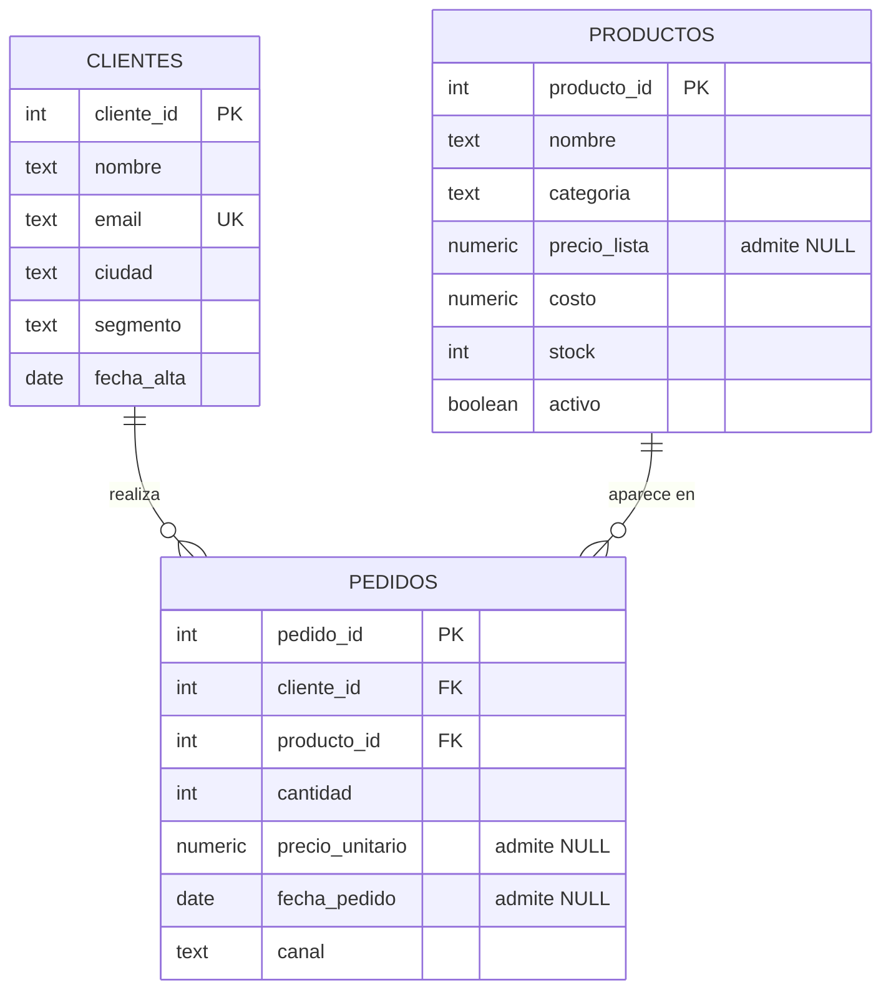

# Análisis exploratorio de ventas de una tienda online

Proyecto Capstone de la cursada de SQL. Ignacio Kalogiannidis. PostgreSQL 16.

Análisis de dos años de operación de una tienda online: modelo de datos, etapa de limpieza y análisis en SQL, escrito para que lo lea quien tiene que tomar las decisiones y no solamente quien revisa el código. Se resuelven los cuatro puntos de análisis del enunciado, que pedía al menos tres, más dos preguntas adicionales: seis en total, con lo que se pasan las cinco preguntas de negocio que pide el documento del módulo.

## El trabajo en una tabla

| Dimensión | Valor |
|---|---|
| Período analizado | 1 de enero de 2024 al 30 de diciembre de 2025, 730 días con pedidos |
| Volumen | 200 clientes de padrón y 190 con compras, 60 productos y 55 con ventas, 4.889 pedidos |
| Facturación medida | 35.288.934,22, de los cuales 1.088.029,65 son de pedidos sin fecha |
| Pedidos sin precio cargado | 734, el 15,0 por ciento |
| Pedidos sin fecha | 157, el 3,2 por ciento |
| Recuperado por la limpieza | 3.397.256,00 |
| Variación interanual | caída del 8,1 por ciento por día con actividad, 8,6 sin normalizar |
| Concentración de cartera | el primer cuartil, 48 clientes, explica el 58,5 por ciento |
| Catálogo sin rotación | 5 productos sin ventas, 347.213,08 a costo |

Todos los importes están en pesos y todas las cifras del documento salen de ejecutar los dos scripts.

## El problema de negocio

La dirección de la tienda tiene que decidir dónde poner el esfuerzo comercial del próximo ejercicio y no tiene con qué fundamentarlo. Hay dos años de pedidos cargados en la base, pero nadie los miró nunca en conjunto. Las preguntas son concretas: de quién depende la facturación, si el negocio está creciendo o cayendo, qué parte del catálogo no se mueve y cuánta plata hay atrapada en productos que no rotan.

Antes de responderlas aparece un problema previo. El quince por ciento de los pedidos no tiene precio cargado y el tres por ciento no tiene fecha. Cualquier total calculado sin tratar esos huecos sale mal, así que la primera parte del trabajo es decidir qué hacer con ellos.

## Cómo ejecutar el código

Se ejecutó sobre PostgreSQL 16. Hace falta el cluster arrancado y un rol con permiso para crear bases. Los dos scripts se corren en orden, desde la carpeta del repositorio:

```bash
createdb capstone_project
psql -v ON_ERROR_STOP=1 -d capstone_project -f estructura.sql
psql -v ON_ERROR_STOP=1 -d capstone_project -f analisis.sql
```

La opción `ON_ERROR_STOP=1` hace que la ejecución corte ante el primer error en lugar de seguir con la base a medio cargar. Con ella, los dos scripts corren de punta a punta sin un solo error.

El primero crea las tres tablas y carga los datos. El segundo perfila, limpia y analiza. Es de lectura salvo por la vista `ventas_limpias`, que crea al principio.

Los dos se pueden volver a correr sobre la misma base. `estructura.sql` empieza eliminando lo que va a recrear, incluida la vista que crea el otro script, y `analisis.sql` usa `CREATE OR REPLACE` sobre esa vista. Se verificó corriendo los dos tres veces seguidas sobre la misma base y una cuarta sobre una base recién creada: la salida de las consultas es idéntica en las cuatro. Lo único que cambia son los avisos de la primera corrida contra una base vacía, donde los `DROP ... IF EXISTS` informan que no había nada que borrar.

Los datos se generan con aritmética modular sobre `generate_series`, sin `random()`. Así cualquiera que clone el repositorio y ejecute los scripts obtiene exactamente las mismas filas y puede reproducir todos los números de este documento.

## Los archivos

| Archivo | Contenido |
|---|---|
| `estructura.sql` | Definición de las tres tablas, carga del dataset, índices y verificación de la carga |
| `analisis.sql` | Perfilado de nulos, vista limpia, control del JOIN y las consultas de análisis |
| `README.md` | Contexto, decisiones de modelado y limpieza, hallazgos y conclusiones |

## Dónde se responde cada punto del enunciado

El enunciado pide resolver al menos tres de sus cuatro puntos de análisis. Están los cuatro. A eso se suman dos preguntas adicionales, marcadas como tales, que no reemplazan ni modifican ninguno de los cuatro.

Cada punto se resuelve primero con la consulta tal como la pide el enunciado, sin columnas de más, y después con una o varias extensiones rotuladas que agregan lo que hace falta para decidir. En `analisis.sql` cada bloque lleva su rótulo en el comentario, del tipo `PUNTO 4, extensión B`, así que se encuentran buscando esa palabra.

| Punto del enunciado | Bloque en `analisis.sql` | Hallazgo en este documento |
|---|---|---|
| Top 5 clientes por gasto total (GROUP BY + SUM) | PUNTO 1, más extensiones A y B | Top 5 clientes por gasto total |
| Ventas totales por mes (funciones de fecha) | PUNTO 2, más extensiones A, B, C y D | Ventas totales por mes |
| 3 productos menos vendidos | PUNTO 3, más extensiones A y B | Los 3 productos menos vendidos |
| Ranking de pedidos por categoría con `RANK()` | PUNTO 4, más extensiones A, B, C y D | Ranking de pedidos por categoría con RANK() |

| Pregunta adicional | Bloque en `analisis.sql` | Hallazgo en este documento |
|---|---|---|
| Segmentación de clientes en cuartiles con `NTILE(4)` | PREGUNTA ADICIONAL 1, más extensiones A, B y C | La segmentación de clientes en cuartiles |
| La facturación por canal de venta | PREGUNTA ADICIONAL 2, más extensión A | La facturación por canal de venta |

## El modelo de datos: diagrama ER



El esquema son tres tablas y una sola relación que importa: `pedidos` cuelga de `clientes` y de `productos`. Se evaluó agregar una cuarta tabla de detalle, para poder juntar varias líneas bajo un mismo ticket, y se descartó: ninguna de las preguntas del análisis necesita ese nivel, y la tabla habría sumado complejidad sin sumar respuestas.

Los tipos se eligieron para no tener que limpiar después: `DATE` para las fechas, `NUMERIC(10,2)` para el dinero y `TEXT` para el texto. El detalle de por qué cada uno está en el comentario de la sección 2 de `estructura.sql`, y el primer bloque de `analisis.sql` verifica que ninguna columna se haya escapado de ese criterio, con un resultado OK o ALERTA escrito al lado.

Las restricciones acompañan esa decisión. El email lleva `UNIQUE` porque identifica al cliente, más un `CHECK` de formato. Las cantidades y los importes llevan `CHECK` de signo: un valor negativo ahí es una carga mal hecha y conviene que la base lo rechace antes de que llegue a una suma. Canal, categoría y segmento son dominios cerrados y se declaran como tales, para que un error de tipeo no invente una quinta categoría que después aparezca como una fila suelta en cada agrupación. Y las claves foráneas impiden un pedido de un cliente o un producto que no existen.

De índices se creó lo mínimo: las dos claves foráneas, por donde `pedidos` se cruza con las otras dos tablas y que PostgreSQL deja sin indexar, y un B-Tree sobre `fecha_pedido`, que es la columna del `WHERE` y del `GROUP BY` de la serie mensual. `canal` y `categoria` quedaron afuera: tienen tan pocos valores distintos que un índice no descarta casi nada, y cada índice de más se paga en cada escritura. El cierre de `analisis.sql` muestra dos planes con `EXPLAIN (COSTS OFF)`: al filtrar por un rango de fechas el planificador elige entrar por `idx_pedidos_fecha` con un Bitmap Index Scan, y al agrupar la serie completa resuelve con recorrido secuencial, que sobre este volumen es lo esperable. Los índices de las claves foráneas, en cambio, el análisis los usa en los `NOT EXISTS` del punto 3 y de la primera pregunta adicional, no en los cruces, que sobre estas tablas el planificador resuelve por Hash Join.

La carga de datos corre dentro de una transacción, de modo que una falla a mitad de camino deje la base como estaba en lugar de con las tablas creadas y los datos incompletos.

## La etapa de limpieza

Toda esta parte sale de distinguir el nulo del cero. Son afirmaciones distintas sobre la misma celda vacía, y tratarlas igual arrastra el error hasta el último total del informe. Por eso cada hueco se trató por separado, con el criterio escrito arriba de la consulta que lo resuelve. Las tres herramientas son `COALESCE`, para completar lo que se puede completar; `CASE`, para dejar etiquetado de dónde salió cada importe; y `NULLIF`, que protege los denominadores de los porcentajes para que una base sin filas devuelva un nulo en lugar de cortar la ejecución con un error de división por cero.

El perfilado inicial encontró que 734 pedidos de 4.889, el 15,0 por ciento, no tienen precio unitario, y que 157, el 3,2 por ciento, no tienen fecha. Esos dos porcentajes están sobre pedidos; el peso en facturación es otro y se mide más abajo.

El hueco de precio tiene dos niveles de gravedad y la consulta los separa. En 416 casos el producto sí tiene precio de lista cargado, así que el importe se completa con `COALESCE` tomando ese precio. Esa sustitución es válida porque las dos columnas están en el mismo orden de magnitud, y eso no se supone: se mide. Sobre los 4.155 pedidos que sí traen precio propio, el descuento contra el precio de lista va del 0,0 al 9,6 por ciento, con una media del 4,77. Si el precio efectivamente cobrado fuera varias veces el de lista, el mismo `COALESCE` subestimaría la facturación de forma sistemática y habría que buscar otra fuente. Con la escala verificada, la operación recuperó 3.397.256,00 que sin la limpieza se habrían perdido en silencio.

Esa recuperación tiene un sesgo y el análisis lo mide en lugar de dejarlo implícito. El precio de lista no lleva descuento, de modo que el importe completado sale más alto que el que se habría facturado. Tomando como referencia lo que se cobró en los demás pedidos de cada artículo, la sobreestimación llega a 161.859,95, el 4,76 por ciento de lo recuperado. La mejora que se desprende de ahí está ejecutada en el mismo script: aplicando el descuento medio observado al precio de lista, el total pasa de 35.288.934,22 a 35.126.723,49, una corrección de 162.210,73. Las dos cifras miden el mismo sesgo por caminos distintos, una comparando contra el precio medio cobrado de cada artículo y la otra aplicando el descuento medio del conjunto, y se apartan en menos de cuatrocientos pesos, lo que da una idea de cuánto depende la estimación del camino elegido. No se adoptó como cifra principal del informe porque supone que el pedido perdido tuvo un descuento de tienda y no uno negociado, pero queda medida para quien prefiera ese criterio.

Los 318 casos restantes son más difíciles: ni el pedido ni el producto tienen precio. El importe queda en nulo y esas ventas se cuentan solamente como unidades movidas, 643 en total; ponerles cero habría afirmado que se regalaron.

No saber el precio, sin embargo, no es lo mismo que no poder acotarlo. Los 54 artículos que tienen cargadas las dos columnas muestran en qué rango se mueve la relación entre lo que cuesta un artículo y lo que sale, y ese rango encierra el precio de los que no lo tienen. El script lo resuelve artículo por artículo y lo totaliza: los 318 pedidos valen entre 3.221.272,69 y 4.646.685,85, con un valor central de 3.804.860,47, el 10,78 por ciento de la facturación informada. El total del informe es un piso, y el piso está diez puntos abajo.

La alternativa obvia, valuar cada pedido al promedio de su rubro, sale peor, y se ve en un caso concreto: el Producto 040 cuesta 124,80 y darle el precio medio de Electrónica lo dejaría con un margen que ningún otro artículo del catálogo tiene cerca.

El análisis verifica además que ese hueco no esté concentrado, y lo hace por dos ejes. Por categoría va del 5,9 por ciento de los pedidos en Indumentaria al 7,3 en Electrónica. Por tamaño de pedido va del 6,3 por ciento en los de una unidad al 6,8 en los de tres. El segundo control importa tanto como el primero: si los pedidos sin precio fueran todos de una unidad, el ticket promedio que informan el punto 1 y la segunda pregunta adicional saldría corrido hacia arriba sin que la comparación entre categorías mostrara nada raro.

Con las fechas la decisión fue la inversa. No hay forma de estimar la fecha de un pedido a partir del resto de la fila, y una fecha inventada contamina cualquier serie temporal sin dejar rastro. Lo que sí se hizo con `COALESCE` fue etiquetar: la columna `periodo` de la vista limpia devuelve el mes del pedido, o la etiqueta "Sin fecha" cuando falta. Así esos pedidos no desaparecen del informe sin que nadie lo note, sino que se reportan como su propio período. Son 1.088.029,65 de facturación que quedan fuera de cualquier análisis temporal.

La limpieza se resuelve una sola vez, en la vista `ventas_limpias`, y todas las consultas parten de ahí salvo cuatro, que miden unidades o antigüedad y no necesitan el precio: la del punto 3 y su extensión A, la extensión D del punto 4 y la extensión C de la primera pregunta adicional. Esas van directamente contra las tablas. Centralizarla evita lo que sale caro de repetirla: bastaría un solo `COALESCE` olvidado para que dos secciones del informe informaran totales distintos.

Por último, el análisis compara el conteo de filas antes y después del JOIN, en los tres cruces que usa. Las 4.889 filas de `pedidos` siguen siendo 4.889 después de unir con `productos`, con `clientes` y con el catálogo para el ranking. El comentario de la sección 1.4 de `analisis.sql` explica por qué ese control merece una consulta propia.

## Hallazgos

Facturación total del período, después de la limpieza: 35.288.934,22, repartida sobre 4.571 pedidos con importe conocido.

### Top 5 clientes por gasto total

| Cliente | Gasto | Peso sobre el total |
|---|---|---|
| Diego Escobar | 848.657,48 | 2,40 por ciento |
| Irina Álvarez | 774.196,40 | 2,19 por ciento |
| Carla Escobar | 767.494,69 | 2,17 por ciento |
| Elena Escobar | 753.973,54 | 2,14 por ciento |
| Bruno Benítez | 744.360,81 | 2,11 por ciento |

Ninguno pesa lo suficiente como para que perderlo sea un problema: los cinco juntos explican el 11,02 por ciento de la facturación. Todos son clientes históricos, con entre 94 y 101 pedidos cada uno y tickets de entre 7.936,56 y 8.572,30, o sea que lo que los pone arriba es la cantidad de compras.

Hay una reserva que el propio análisis deja a la vista. El quinto puesto le saca al sexto 754,10 pesos, mientras que cada uno de esos dos clientes arrastra cuatro o cinco pedidos sin importe conocido, que valen miles. El orden de los cinco primeros es el que la base permite calcular, pero la frontera del quinto puesto no es una conclusión firme: cargar los precios que faltan la puede dar vuelta.

### Ventas totales por mes

2024 cerró en 17.864.551,46 y 2025 en 16.336.353,11: una caída del 8,6 por ciento interanual. Los dos años no traen la misma cantidad de días con pedidos, 366 contra 364, porque el período cargado arranca el 1 de enero de 2024 y corta el 30 de diciembre de 2025. Dividiendo por día con actividad la baja queda en 8,1 por ciento, que es el número que corresponde citar.

Mirando la serie mensual eso no se ve. La variación de un mes contra el anterior tiene una media absoluta del 5,3 por ciento, con un desvío de 4,3 puntos, y llega a moverse entre el 11,8 por ciento negativo y el 16,9 positivo. Con esa amplitud, cualquier mes puede parecer un desastre o un récord sin que nada haya cambiado.

La primera sospecha es que buena parte de esa amplitud venga del calendario, ya que un febrero de veintiocho días arranca en desventaja contra un enero de treinta y uno. El análisis la descarta midiendo: normalizando por día con actividad, la media absoluta queda en 5,4 por ciento y los extremos en 10,4 negativo y 13,8 positivo. Los valores se corren de mes, pero la amplitud es la misma. O sea que el ruido mensual de esta operación es ruido y no calendario, y por eso no hay forma de leer un mes suelto como señal.

En la práctica, la comparación interanual es la que aguanta el ruido de esta serie. La razón no es que su número sea más grande: cada uno de sus dos términos descansa sobre más de dos mil doscientos pedidos, 2.479 y 2.253, y con esa cantidad la oscilación que domina el mes a mes se promedia sola. Reaccionar a un mes malo aislado, en esta operación, es reaccionar a una variación que no significa nada.

### Los 3 productos menos vendidos

La consulta devuelve los productos 056, 057 y 058, pero el recorte es arbitrario: hay cinco artículos empatados en cero unidades y quedarse con tres es cortar entre iguales. Por eso el análisis lista los cinco y los ordena por capital inmovilizado, que es lo que decide por cuál conviene empezar.

Son cinco artículos sin una sola venta en dos años, con 124 unidades en depósito. A costo, eso es 347.213,08 de capital inmovilizado. Contra la facturación del período da un 1,0 por ciento, que hay que leer como orden de magnitud: una cifra está valuada a costo y la otra a precio de venta, de manera que el cociente no es una proporción contable. De esos cinco, cuatro siguen marcados como activos en el catálogo. El que más capital tiene parado es el Producto 059, con 44 unidades y 146.020,16.

Esa lista aparece porque la consulta une con `LEFT JOIN` desde `productos`. Un `INNER JOIN` habría devuelto los productos con pocas ventas y escondido a los que no vendieron nada, que son los que la pregunta busca.

### Ranking de pedidos por categoría con RANK()

El ranking sale entero: una fila por cada uno de los 4.571 pedidos con importe conocido, con el puesto que le toca dentro de su categoría. Una extensión aparte repite la cabeza de cada categoría, que es el tramo que se lee para decidir, y ahí aparece algo que conviene revisar antes de leer nada: en las cinco el primer puesto está empatado entre dos pedidos, y los diez tienen el precio completado por la limpieza. La explicación es aritmética. Al imputar el precio de lista, sin descuento, esos pedidos toman el importe máximo posible de su producto, así que le ganan a cualquier pedido real del mismo artículo y empatan entre sí.

Por eso hay una tercera versión, con el mismo ranking restringido a los pedidos con precio original. Ahí los empates desaparecen y el podio queda formado por pedidos que se cobraron de verdad. La comparación entre las dos salidas es el resultado que importa de este punto: un ranking construido sobre datos imputados premia a las filas estimadas, y la forma de verlo es dejar las dos versiones a la vista en lugar de aplicar el filtro en silencio.

Como decisión de negocio, el ranking de pedidos rinde poco: cada fila es una compra suelta y no dice nada del artículo detrás. La extensión que agrupa por producto es la que responde de qué artículos depende cada categoría, y ahí sí aparece una diferencia grande entre rubros. En Deportes el Producto 008 se lleva el 38,3 por ciento de la facturación de su categoría, y en Electrónica el Producto 005 llega al 30,0, mientras que en Librería el primero apenas alcanza el 17,0 y los tres primeros quedan dentro de cuatro puntos entre sí. La explicación está en la misma tabla y tiene dos patas, porque la facturación de un artículo es unidades por precio y hace falta mirar las dos columnas. Los primeros puestos de Deportes, Electrónica, Hogar e Indumentaria son artículos de mucha rotación, con entre 461 y 471 unidades contra las 122 a 131 del resto. Librería también tiene uno de esos, el Producto 004 con 462 unidades, pero es barato y queda cuarto, detrás de tres artículos de poca rotación y mucho precio. Es decir que concentra la categoría que tiene un artículo que junta las dos cosas, y no la que tiene el artículo más vendido ni la que tiene el más caro.

Hay un tercer factor y es el tamaño del denominador. Electrónica factura la mitad que las otras cuatro, así que el mismo volumen pesa más: su primer puesto llega al 30,0 por ciento con un artículo cuyo precio implícito es el más bajo de los cinco primeros puestos.

Ese porcentaje es un techo, y el análisis lo acota. Un producto entra al ranking solo si tiene ventas y precio de lista, y con esas dos condiciones quedan 10 de los 12 artículos de cada categoría, en las cinco. Las unidades de los excluidos, entre 124 y 135 según la categoría, no suman al denominador. La exclusión es pareja en unidades, pero no en peso relativo: la facturación que entra al ranking de Electrónica es 4.256.738,38 contra 7.017.866,34 de la siguiente más chica y 8.088.779,96 de la más grande, de manera que ahí las mismas unidades excluidas pesan entre una vez y media y casi el doble, según contra qué categoría se compare. El 30,0 por ciento del Producto 005 es el que hay que leer con más reserva.

### La segmentación de clientes en cuartiles

El primer cuartil, 48 de los 190 clientes que compraron, explica el 58,5 por ciento de la facturación. Los otros tres aportan el 16,6, el 14,0 y el 10,9. La concentración es fuerte, y la columna que la explica no es el ticket, sino la frecuencia. Esos 48 clientes hicieron 2.748 de los 4.889 pedidos, o sea que su participación en la facturación y su participación en los pedidos son casi la misma. Los importes medios por pedido de los cuatro cuartiles son 7.993,67, 8.375,57, 7.383,56 y 6.207,98, calculados sobre los pedidos con importe conocido: el primer cuartil no encabeza esa columna, la encabeza el segundo.

Eso cambia qué acción corresponde. No se trata de clientes que compran caro, sino de clientes que compran seguido, así que lo que hay que proteger es la frecuencia: un programa de retención sobre ellos vale más que cualquier intento de subirles el ticket.

Hay que precisar dónde termina ese grupo. `NTILE(4)` corta por cantidad de clientes y no por quiebre de la distribución, y las dos cosas no coinciden. El corte entre el primer cuartil y el segundo separa a un cliente de 130.461,82 de otro de 130.195,14: menos de trescientos pesos, que es una fracción de un solo pedido de cualquiera de los dos. Esa frontera no es un dato firme. El quiebre real de la distribución está bastante más arriba: el salto más grande entre dos clientes consecutivos cae entre el puesto 25 y el 26, donde el gasto pasa de 577.406,48 a 175.950,39. Esos 25 primeros explican el 49,1 por ciento de la facturación, casi tanto como los otros 165 juntos. Los clientes de la parte baja del primer cuartil se parecen mucho más a los del segundo que a los de arriba. El programa conviene armarlo sobre los primeros 25.

Los cuartiles se calculan sobre los 190 clientes que compraron, y los 10 sin actividad quedan en una categoría aparte en lugar de diluirse dentro del último cuartil. Separarlos importa para la lectura: mezclados, el cuartil de menor gasto parecería peor de lo que es, cuando en realidad el problema de esos diez no es que gasten poco sino que nunca empezaron. Aparecen porque la consulta usa `LEFT JOIN` desde `clientes`; con un `INNER JOIN` no existirían en el informe.

Y son un caso con nombre propio. Las diez altas sin ninguna compra son las diez más recientes del padrón, todas de diciembre de 2023, con dieciséis días entre la primera y la última. No es una cartera vieja que se apagó: es la última tanda de captación que todavía no convirtió. El costo de captación ya se pagó y los datos ya están cargados, así que la activación sale barata.

### La facturación por canal de venta

El marketplace concentra el 43,6 por ciento de la facturación y la app el 27,8, mientras que web y teléfono aportan el 14,5 y el 14,1. Visto así parece que hay canales buenos y canales malos.

El resto de las columnas dice otra cosa. El ticket promedio es parecido en los cuatro, entre 7.509,61 y 7.862,79, una diferencia de menos de cinco puntos, y el canal más chico en facturación no es el de ticket más bajo. La composición por antigüedad de cliente también es pareja, con los clientes nuevos aportando entre el 21,1 y el 22,2 por ciento en todos los casos.

O sea que en este dataset la diferencia entre canales es de volumen y no de calidad de venta: 2.096 pedidos en el marketplace contra 699 en la web. Conviene aclarar que el reparto de pedidos entre canales está fijado por el generador de datos, así que la brecha en sí no es un hallazgo de esta base. Lo que el análisis muestra es el procedimiento: cuando la facturación por canal difiere pero el ticket y la composición de cartera se mantienen, lo que está en juego es el alcance del canal y no su propuesta comercial. Contestar eso pide datos de tráfico que esta base no tiene.

## Conclusiones

La caída se mide contra el año anterior y no contra el mes anterior, porque la serie mensual de esta operación no distingue una señal de una oscilación, y se mide por día con actividad, porque medio punto de la diferencia es calendario. El número que corresponde citar es 8,1 por ciento.

El esfuerzo comercial tiene dos puntas con retorno medible y una sola prioridad entre ellas. La primera es la retención de los 25 clientes que están arriba del quiebre de la distribución, que explican el 49,1 por ciento de la facturación a fuerza de comprar seguido. Lo que hay que sostener ahí es el ritmo de compra. La segunda es la activación de las diez altas de diciembre de 2023 que nunca compraron. La retención va primero porque el monto en juego es de otro orden, pero la activación es más barata y se puede hacer en paralelo.

En el catálogo hay dos decisiones. Una es liquidar los cinco artículos sin ventas, empezando por el Producto 059, que es el que más capital tiene parado. La otra es tratar como críticos para el abastecimiento a los artículos de los que cuelga una categoría entera, el Producto 008 en Deportes y el 005 en Electrónica, porque una rotura de stock de cualquiera de los dos se lleva entre el 30,0 y el 38,3 por ciento de la facturación de su rubro.

La brecha entre canales no entra en esta lista. Mientras el ticket y la composición de cartera sean los mismos en los cuatro, es un problema de alcance y no hay con qué decidirlo desde esta base.

Todo esto, sin embargo, viene después de arreglar la carga de datos. Que el quince por ciento de los pedidos llegue sin precio y el tres por ciento sin fecha no es un problema de análisis sino de sistema, y mientras siga así todos estos números van a tener que venir con una nota al pie.

## Limitaciones

El dataset es sintético y lo genera `estructura.sql`. La consigna ofrece tres opciones de dataset y la tercera es construir uno mismo las tablas `clientes`, `pedidos` y `productos`; se eligió esa. El motivo es la reproducibilidad: un dataset descargado obliga a que quien clone el repositorio consiga el mismo archivo, con la misma versión y el mismo encoding, mientras que así los dos scripts se bastan solos y cualquiera obtiene exactamente las filas que producen los números de este documento.

Eso obliga a decir con precisión qué está sembrado en el generador y qué emerge de los datos, porque son cosas distintas y mezclarlas convertiría el informe en una descripción de sus propias fórmulas. Están sembrados: la retracción del segundo año, que se produce descartando dos de cada veintitrés pedidos a partir del día 366; el reparto de pedidos entre canales, que está fijado en un arreglo de siete posiciones; la concentración de la cartera en los primeros veinticinco clientes, que es también el motivo de que el quiebre de la distribución de gasto caiga justo en el puesto 25; la mayor rotación de los ocho primeros artículos, que por la fórmula del precio son además los ocho más baratos del catálogo, de modo que la relación entre rotación y precio de esos ocho tampoco es un dato; los cinco artículos del final del catálogo que quedan fuera del rango de asignación y por eso no registran ninguna venta; y las diez últimas altas del padrón, que quedan fuera por el mismo motivo. Los huecos de precio y de fecha también se inyectan a propósito, que es el punto de tener una etapa de limpieza.

Conviene ser claro además sobre un límite de fondo de cualquier dataset generado. Al ser determinista, cada columna se deduce del identificador de la fila, así que alguien que reconstruya las fórmulas puede recuperar cualquier dato faltante, incluidos los precios de lista que el informe trata como perdidos. Eso no se puede evitar y no tiene sentido disimularlo. Lo que sí se cuidó es que el hueco no se despeje desde las tres tablas, que es lo único que tendría delante un analista: el precio de lista no sigue el orden del catálogo, de modo que estimarlo con los artículos vecinos erra en cuatro de los seis casos, y como cada artículo lleva su propio margen, el de al lado tampoco lo delata. El análisis no usa ninguno de los dos caminos, porque sobre datos reales no existirían.

Lo que no está sembrado, y por lo tanto es donde el análisis aporta, es todo lo que se deriva de cruzar esas piezas: que la concentración del primer cuartil venga de la frecuencia y no del ticket, que el corte del `NTILE` caiga lejos del quiebre de la distribución y que el procedimiento para encontrar ese quiebre lo detecte, que el orden del quinto y el sexto cliente dependa de los pedidos sin precio, que el ranking de pedidos quede encabezado por importes imputados, que la concentración de una categoría necesite un artículo que junte rotación y precio y no alcance con una de las dos, que el precio faltante se pueda acotar desde el costo aunque no se lo pueda saber, y que la amplitud de la serie mensual no se explique por la cantidad de días del mes. Y, sobre todo, el procedimiento: separar el ruido mensual de la tendencia, declarar el denominador de cada promedio, controlar la cardinalidad de cada cruce y medir el sesgo de la imputación en lugar de suponerlo. El período cubierto son dos años, con pedidos en los 730 días. Alcanza para comparar ejercicios, pero no para separar tendencia de estacionalidad con confianza: haría falta un tercer año para determinar si la caída es una tendencia o parte de un ciclo.

Por último, la facturación reportada hay que leerla como una banda asimétrica. Tiene un hueco para abajo, los 318 pedidos sin ninguna fuente de precio, que estimados desde el costo son el 10,78 por ciento del total informado, y un sesgo para arriba, los 416 imputados a precio de lista, que valen 161.859,95. El hueco es más de veinte veces el sesgo, así que el número del informe es un piso y no un punto medio. Los cuartiles de la primera pregunta adicional heredan el mismo problema: el cuartil se asigna por gasto medido, y un cliente con más pedidos sin precio baja de cuartil sin que su gasto real haya sido menor.

La comparación interanual deja además fuera los 157 pedidos sin fecha, que son alrededor del tres por ciento de la facturación medida. No hay forma de asignarlos a un año, así que el 8,1 por ciento es la mejor cifra disponible, pero se calcula sobre el noventa y siete por ciento del período.

## Referencias

Documentación oficial de PostgreSQL 16, que es la versión sobre la que se ejecutó todo. Se indica el apartado y dónde se apoya.

| Tema | Apartado | Enlace | Dónde se usa |
|---|---|---|---|
| `NUMERIC` es de precisión exacta y el punto flotante es inexacto | 8.1.2. Arbitrary Precision Numbers | https://www.postgresql.org/docs/16/datatype-numeric.html | Elección de tipos en `estructura.sql` |
| Las funciones de ventana solo se admiten en el `SELECT` y en el `ORDER BY`, y el frame por defecto con `ORDER BY` incluye a las filas con el mismo valor que la actual | 4.2.8. Window Function Calls | https://www.postgresql.org/docs/16/sql-expressions.html | Puntos 1 y 4 y primera pregunta adicional de `analisis.sql` |
| `RANK` deja huecos después de cada empate, `ROW_NUMBER` numera siempre de forma consecutiva y `NTILE` reparte en grupos del tamaño más parejo posible | 9.22. Window Functions | https://www.postgresql.org/docs/16/functions-window.html | Punto 4 y primera pregunta adicional |
| `FILTER` restringe qué filas entran en una agregación sin necesidad de una consulta aparte | 4.2.7. Aggregate Expressions | https://www.postgresql.org/docs/16/sql-expressions.html | Perfilado de nulos y segunda pregunta adicional |
